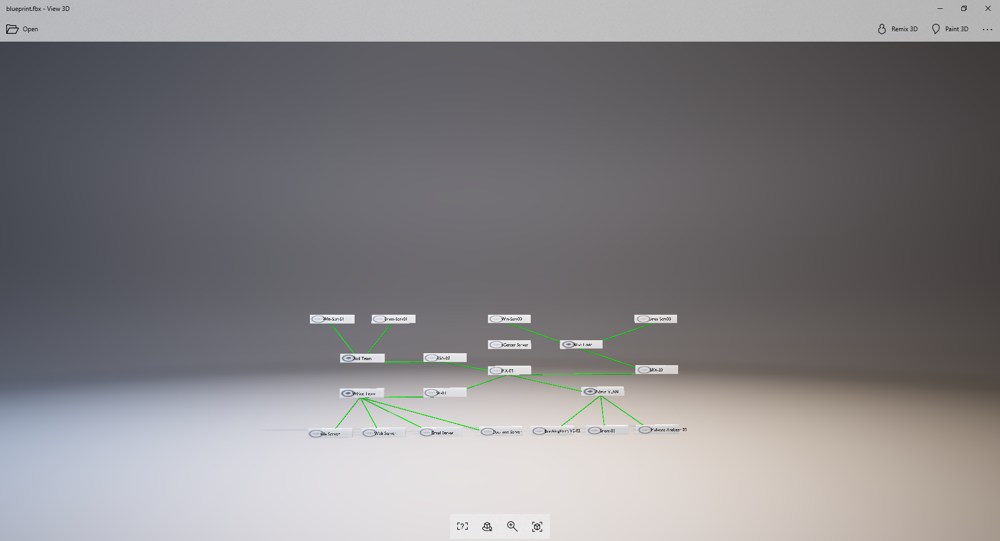

# CloudShell3DSandbox
Playing around with some 3D tech to visualize a sandbox using blender. This is still a proof of concept as the location of points are random rather than copying a good layout and it is still missing connectors and not ugly colors.

Right now this generates an FBX file which can be viewed in programs. I'm using the one built into Windows 10.

Execute this script inside [Blender](https://www.blender.org/) to run.

[Sample of 3D model is here](https://skfb.ly/6sKwF)

There are two scripts. The first uses the Sandbox API and generates one based on the sandbox ID. The latter uses the XML file generated when exporting a Blueprint as the source.

The former lacks some definitions like the connectivity and coordinates. The latter contains this information.

