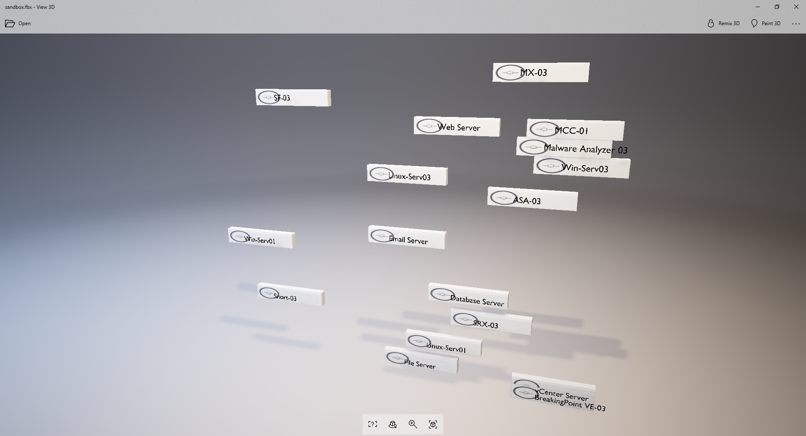

# CloudShell3DSandbox
Playing around with some 3D tech to visualize a sandbox using blender.

Right now this generates an FBX file which can be viewed in programs. I'm using the one built into Windows 10.

Execute this script inside [Blender](https://www.blender.org/) to run.

